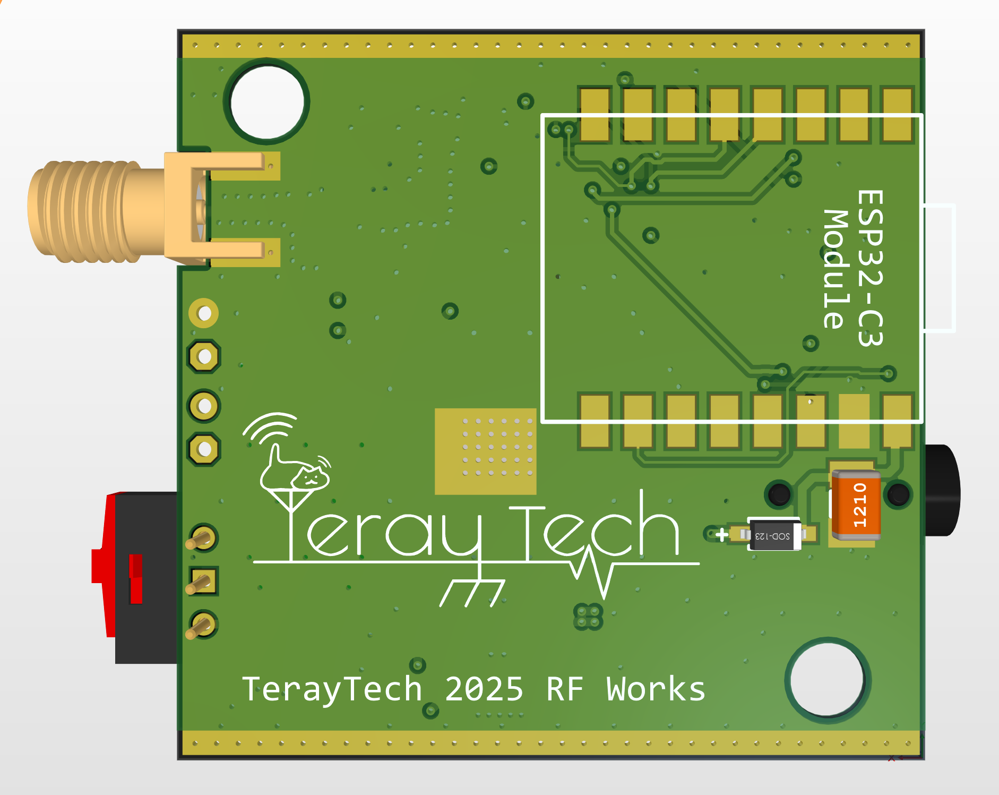

# ESP32C3 QN8027 FM 发射机

<!-- Coilcraft Logo to be added - see img/coilcraft_logo_instructions.txt -->

**赞助商：Coilcraft**

本项目使用 Coilcraft 公司的 0805HP 系列陶瓷贴片电感提升我们的设计性能。

[English Version](README_EN.md) | [日本語版](README_JP.md)

## PCB 展示

  
  

一个基于ESP32和QN8027芯片的功能强大的FM调频发射器，支持RDS，配备OLED显示和Web配置界面！

## ✨ 功能特点

- 📻 支持76-108MHz频段调频发射
- 📱 手机/电脑WiFi远程配置
- 📟 OLED实时显示工作状态
- 📝 RDS电台名称和文本信息支持
- 💾 断电参数自动保存
- 🔊 可调发射功率和音频偏差
- 🖥️ 完整的串口命令控制

## 📖 使用说明

### 硬件连接

| ESP32 引脚 | 连接设备 |
| --- | --- |
| GPIO8 (SDA) | OLED & QN8027 SDA |
| GPIO9 (SCL) | OLED & QN8027 SCL |
| VIN | 2S Li-ion/Li-Po电池 |
| GND | 地 |
| 音频输入 | QN8027音频输入端 |

### 首次启动

1. 给设备上电，它将尝试连接预设的WiFi
2. 如连接失败，设备将自动创建一个名为"FM_Transmitter_AP"的WiFi热点(密码:12345678)
3. 连接到该热点，通过浏览器访问`192.168.4.1`进入Web配置界面
4. 或通过串口(115200波特率)发送命令控制设备

### Web配置界面

通过Web界面，您可以设置：
- 发射频率 (76-108MHz)
- 发射功率 (0-100%)
- RDS信息 (电台名称和广播文本)
- 音频选项 (单声道/立体声，预加重等)

## 🔍 串口命令列表

以下命令可通过串口终端(115200波特率)发送：

| 命令 | 功能 | 示例 |
| --- | --- | --- |
| `freq <76-108>` | 设置发射频率(MHz) | `freq 88.8` |
| `power <0-100>` | 设置发射功率(%) | `power 75` |
| `name <文本>` | 设置电台名称(最多8字符) | `name EMOE-FM` |
| `text <文本>` | 设置RDS文本 | `text Welcome to my station!` |
| `rds on/off` | 启用/禁用RDS | `rds on` |
| `mono on/off` | 启用/禁用单声道 | `mono off` |
| `status` | 显示当前状态 | `status` |
| `reset` | 重置FM发射机 | `reset` |
| `help` | 显示帮助信息 | `help` |

## 🔧 自定义设置

如需修改默认配置，可编辑源代码中以下内容：
- WiFi连接信息 (`default_ssid` 和 `default_password`)
- AP模式设置 (`ap_ssid` 和 `ap_password`)
- 默认发射参数 (频率、功率等)

## 📦 依赖库

- QN8027Radio
- ArduinoJson
- Adafruit_SSD1306
- AsyncTCP
- ESPAsyncWebServer

## 🚀 安装与编译

1. 使用Arduino IDE或PlatformIO
2. 安装所有依赖库
3. 编译上传到ESP32开发板
4. 将网页文件上传到SPIFFS文件系统

## 👨‍💻 作者

[TerayTech](https://space.bilibili.com/24434095)

## 🏠 我们的工作室

[E萌工作室](https://emoe.xyz/)

## 📜 许可证

本项目采用MIT许可证 - 详情请查看LICENSE文件
