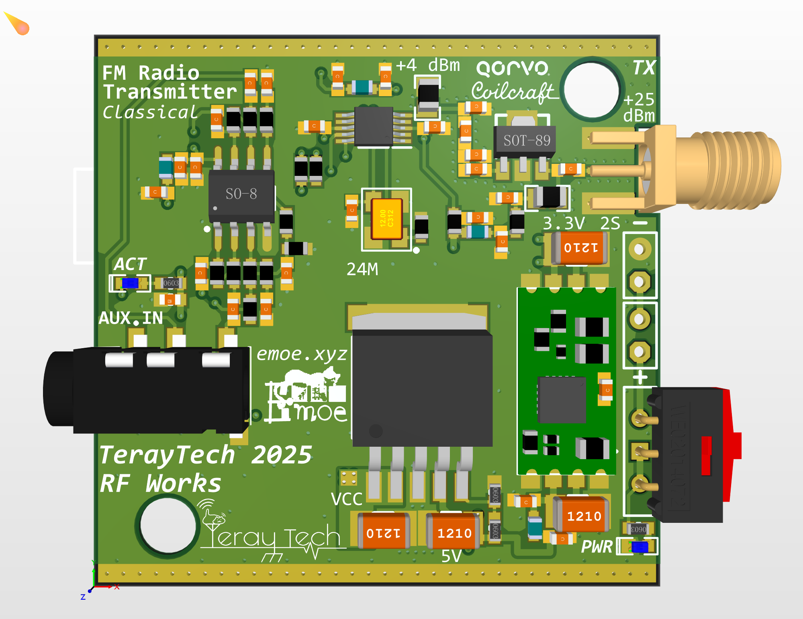
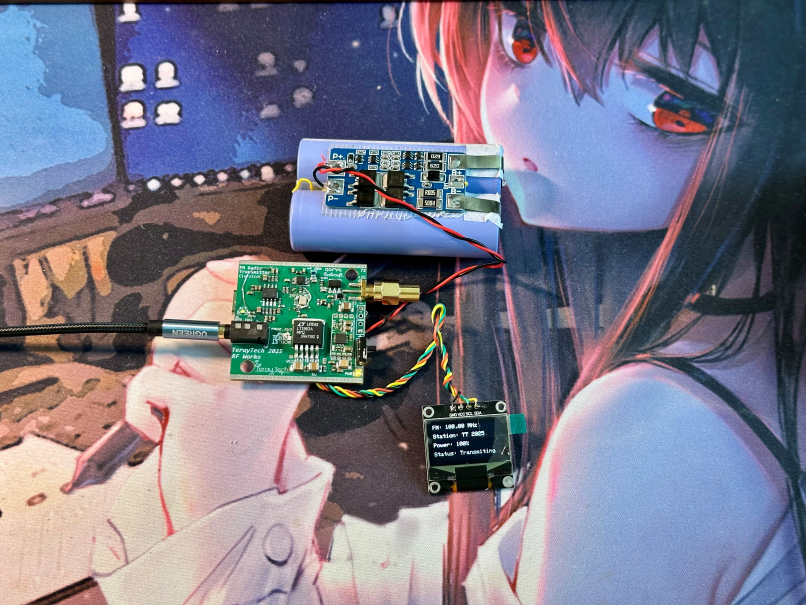

# ESP32C3 QN8027 FM Transmitter

<!-- Coilcraft Logo to be added - see img/coilcraft_logo_instructions.txt -->

**Sponsor: Coilcraft**

This project uses Coilcraft's 0805HP series ceramic chip inductors to enhance our design performance.

## PCB Showcase

  
  

A powerful FM transmitter based on ESP32 and QN8027 chip, with RDS support, OLED display, and Web configuration interface!

## ✨ Features

- 📻 FM transmission in 76-108MHz range
- 📱 Remote configuration via WiFi
- 📟 Real-time status on OLED display
- 📝 RDS station name and text support
- 💾 Auto-save parameters on power off
- 🔊 Adjustable transmission power and audio deviation
- 🖥️ Complete serial command control

## 📖 Usage

### Hardware Connection

| ESP32 Pin | Connected Device |
| --- | --- |
| GPIO8 (SDA) | OLED & QN8027 SDA |
| GPIO9 (SCL) | OLED & QN8027 SCL |
| VIN | 2S Li-ion/Li-Po battery |
| GND | Ground |
| Audio Input | QN8027 audio input |

### First Boot

1. Power on the device, it will try to connect to the preset WiFi
2. If connection fails, the device will create a WiFi hotspot named "FM_Transmitter_AP" (password: 12345678)
3. Connect to the hotspot and navigate to `192.168.4.1` in your browser for Web configuration
4. Or control the device via serial port (115200 baud rate)

### Web Configuration Interface

Through the Web interface, you can set:
- Transmission frequency (76-108MHz)
- Transmission power (0-100%)
- RDS information (station name and broadcast text)
- Audio options (mono/stereo, pre-emphasis, etc.)

## 🔍 Serial Command List

The following commands can be sent through the serial terminal (115200 baud rate):

| Command | Function | Example |
| --- | --- | --- |
| `freq <76-108>` | Set transmission frequency (MHz) | `freq 88.8` |
| `power <0-100>` | Set transmission power (%) | `power 75` |
| `name <text>` | Set station name (max 8 chars) | `name EMOE-FM` |
| `text <text>` | Set RDS text | `text Welcome to my station!` |
| `rds on/off` | Enable/disable RDS | `rds on` |
| `mono on/off` | Enable/disable mono audio | `mono off` |
| `status` | Display current status | `status` |
| `reset` | Reset FM transmitter | `reset` |
| `help` | Show help information | `help` |

## 🔧 Customization

To modify default configurations, edit the following in the source code:
- WiFi connection details (`default_ssid` and `default_password`)
- AP mode settings (`ap_ssid` and `ap_password`)
- Default transmission parameters (frequency, power, etc.)

## 📦 Dependencies

- QN8027Radio
- ArduinoJson
- Adafruit_SSD1306
- AsyncTCP
- ESPAsyncWebServer

## 🚀 Installation & Compilation

1. Use Arduino IDE or PlatformIO
2. Install all required libraries
3. Compile and upload to ESP32 board
4. Upload web files to SPIFFS file system

## 👨‍💻 Author

[TerayTech](https://space.bilibili.com/24434095)

## 🏠 Our Studio

[EMOE Studio](https://emoe.xyz/)

## 📜 License

This project is licensed under the MIT License - see the LICENSE file for details
