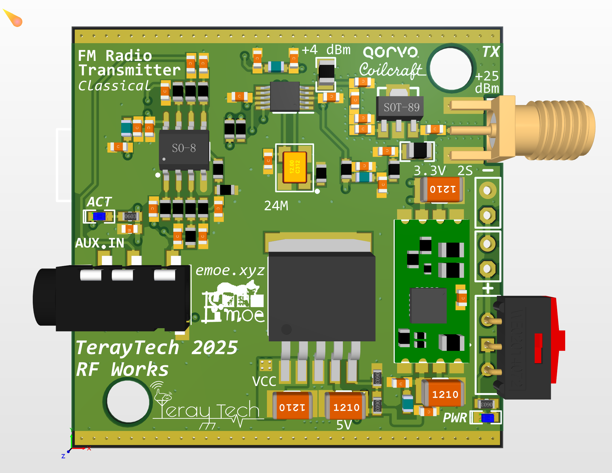
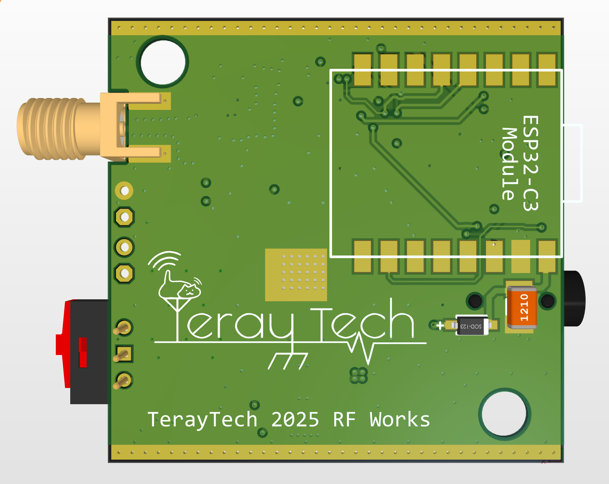
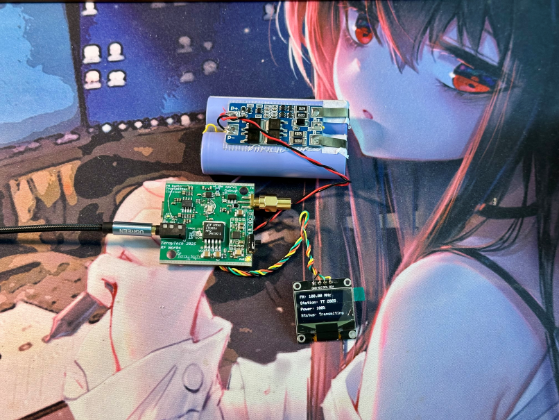
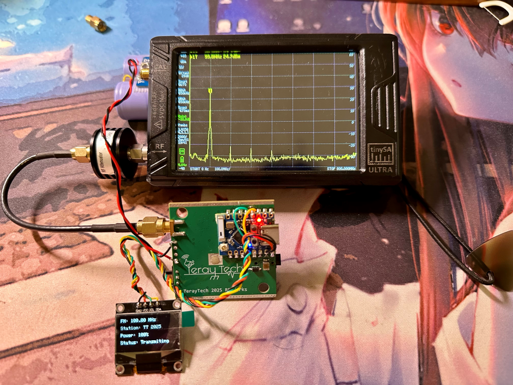

# ESP32C3 QN8027 FM トランスミッター

**スポンサー：Coilcraft**

本プロジェクトでは、Coilcraft社の0805HPシリーズセラミックチップインダクタを使用して設計性能を向上させています。

## PCB ショーケース

  
  

ESP32とQN8027チップをベースにした強力なFMトランスミッター。RDSサポート、OLEDディスプレイ、Webコンフィギュレーションインターフェースを搭載！

## ✨ 特徴

- 📻 76-108MHz範囲のFM送信
- 📱 WiFi経由のリモート設定
- 📟 OLEDディスプレイでのリアルタイムステータス表示
- 📝 RDSステーション名とテキストサポート
- 💾 電源オフ時のパラメータ自動保存
- 🔊 調整可能な送信電力とオーディオ偏差
- 🖥️ 完全なシリアルコマンドコントロール

## 📖 使用方法

### ハードウェア接続

| ESP32 ピン | 接続デバイス |
| --- | --- |
| GPIO8 (SDA) | OLED & QN8027 SDA |
| GPIO9 (SCL) | OLED & QN8027 SCL |
| VIN | 2S Li-ion/Li-Poバッテリー |
| GND | グラウンド |
| オーディオ入力 | QN8027オーディオ入力 |

### 初回起動

1. デバイスの電源を入れると、プリセットのWiFiに接続を試みます
2. 接続に失敗した場合、デバイスは「FM_Transmitter_AP」という名前のWiFiホットスポットを作成します（パスワード：12345678）
3. そのホットスポットに接続し、ブラウザで`192.168.4.1`にアクセスしてWeb設定インターフェースを開きます
4. またはシリアルポート（115200ボーレート）経由でデバイスを制御します

### Web設定インターフェース

Webインターフェースでは、以下の設定が可能です：
- 送信周波数（76-108MHz）
- 送信電力（0-100%）
- RDS情報（ステーション名と放送テキスト）
- オーディオオプション（モノラル/ステレオ、プリエンファシスなど）

## 🔍 シリアルコマンドリスト

以下のコマンドはシリアル端末（115200ボーレート）から送信できます：

| コマンド | 機能 | 例 |
| --- | --- | --- |
| `freq <76-108>` | 送信周波数の設定（MHz） | `freq 88.8` |
| `power <0-100>` | 送信電力の設定（%） | `power 75` |
| `name <テキスト>` | ステーション名の設定（最大8文字） | `name EMOE-FM` |
| `text <テキスト>` | RDSテキストの設定 | `text Welcome to my station!` |
| `rds on/off` | RDSの有効/無効 | `rds on` |
| `mono on/off` | モノラルオーディオの有効/無効 | `mono off` |
| `status` | 現在のステータス表示 | `status` |
| `reset` | FMトランスミッターのリセット | `reset` |
| `help` | ヘルプ情報の表示 | `help` |

## 🔧 カスタマイズ

デフォルト設定を変更するには、ソースコードで以下を編集します：
- WiFi接続詳細（`default_ssid`と`default_password`）
- APモード設定（`ap_ssid`と`ap_password`）
- デフォルトの送信パラメータ（周波数、電力など）

## 📦 依存ライブラリ

- QN8027Radio
- ArduinoJson
- Adafruit_SSD1306
- AsyncTCP
- ESPAsyncWebServer

## 🚀 インストールとコンパイル

1. Arduino IDEまたはPlatformIOを使用
2. 必要なライブラリをすべてインストール
3. ESP32ボードにコンパイルしてアップロード
4. WebファイルをSPIFFSファイルシステムにアップロード

## Output Power Test

## 👨‍💻 作者

[TerayTech](https://space.bilibili.com/24434095)

## 🏠 スタジオ

[EMOEスタジオ](https://emoe.xyz/)

## 📜 ライセンス

このプロジェクトはMITライセンスの下でライセンスされています - 詳細はLICENSEファイルをご覧ください
